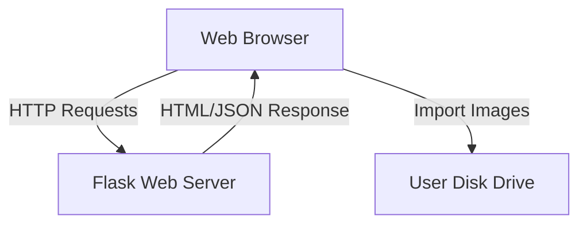

# Hand Digit Image Recognition

This web app is made using Flask framework and is all about predicting the hand sign digit images based on the deep learning model trained using transfer learning.


# Glimpse

https://user-images.githubusercontent.com/72191416/201943098-c8f5fd8b-ec7d-4e5d-883d-8b69109b946f.mp4

# Python Version
Install Python 3.10 from the python website: https://www.python.org/downloads/release/python-3100/

# Dependencies

- Flask
- TensorFlow (Keras)
- Numpy
- Pillow (PIL)

## UI Framework

- Bootstrap

# Get Started

Clone the repository in your project directory.

```commandline
git clone https://github.com/Sachin-crypto/Flask_Image_Recognition.git
```
OR

Download as **[ZIP](https://github.com/Sachin-crypto/Flask_Image_Recognition/archive/refs/heads/main.zip)** file and extract it in your project directory.

# Setting up Virtual Envrionment
In your terminal set the current directory to the project folder and run the following commands in sequence:
```commandline
<python 3.10 directory>/python.exe -m venv venv
```
``` commandline
./venv/Scripts/activate
```

Once you're inside the virtual environment, you may begin installing the dependencies

# Install Dependencies

Install the dependencies from the **requirements.txt** file.

```commandline
pip install -r requirements.txt
```

# Run

**cd** into the current directory and run the script.

```commandline
flask --app app.py run --debug
```
Click [here](https://geekpython.in/run-flask-app-from-the-command-line-in-windows) to get the detailed guide on running the Flask app from the command line.

# Test

- Choose an image from the test images folder.
- You will see a preview of the uploaded image.
- Click on **Submit** button and see the magic.

# Architecture
